# AD Password Reset Tool


## 1. Purpose
This SOP explains installation, configuration, delegated AD permissions, and operational use of the **ad-password-reset** executable-based tool for password resets and account unlocks.

---

## 2. Delegated AD Permissions (Including Screenshots)

### Step 1 - Enable Advanced Features
In ADUC, enable 'Advanced Features'  
(View → Advanced Features).

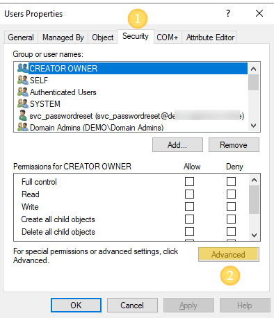

### Step 2 - Open Security Properties
Right‑click the OU → Properties → Security → Advanced.

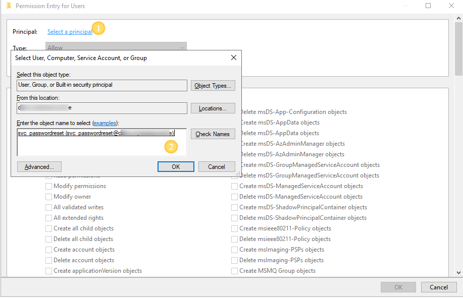

### Step 3 - Add Service Account
Click **Add** → select `svc_passwordreset`.

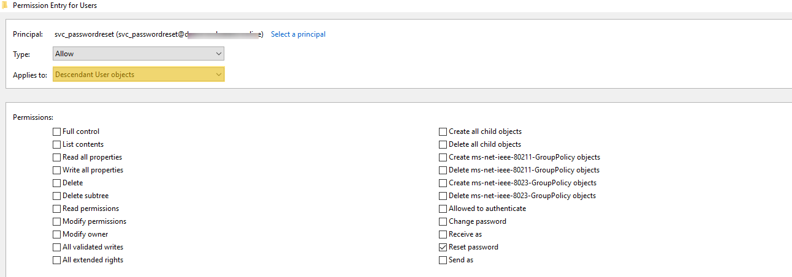

### Step 4 - Apply ACL to Descendant User Objects
Set **Applies to:**  
**Descendant User Objects**

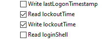

### Step 5 - Enable Required Permissions
Enable:
- **Read lockoutTime**  
- **Write lockoutTime**

Apply changes and exit.

---

## 3. Create Service Account
Create an AD user account named for example:  
**svc_passwordreset**

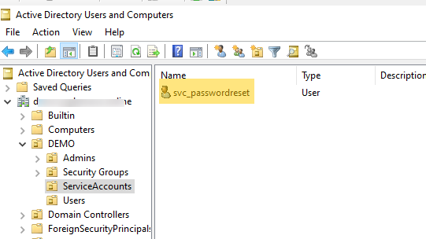

Ensure this account is placed in a secure OU and cannot log on interactively.

Also configure:  
`reset_group = AD group permitted to use the tool`

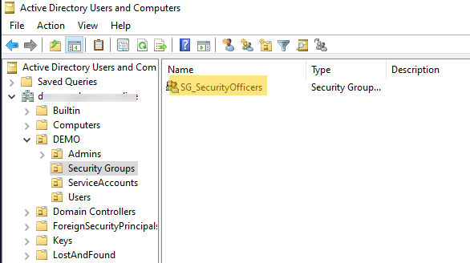
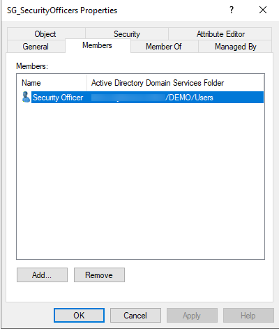

---

## 4. Configure Application (config.ini)
Copy `config-sample.ini` → `config.ini`.

Configure:

```
server = ldaps://<domaincontroller>
domain = YOURDOMAIN
user_ou = OU path containing user accounts
reset_group = <AD group allowed to use tool>
new_password = <temporary password>
```

Configure service account credentials under `[service_account]`.

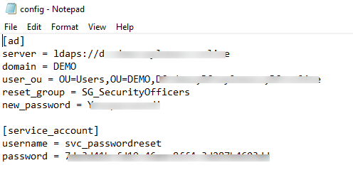
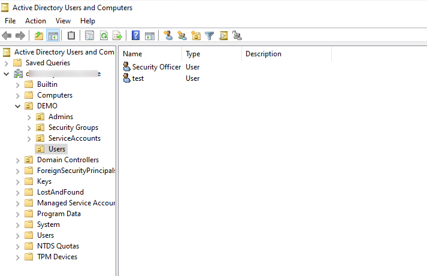
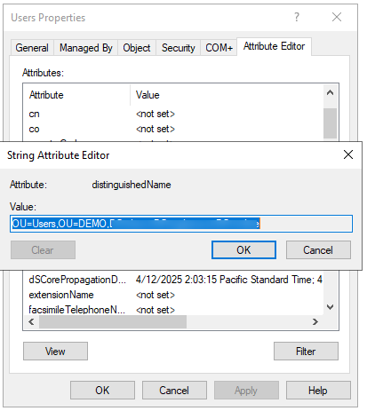

---

## 5. Launch the Application
Run the executable:

```
app.exe
```

Open a browser:

```
http://<host>:5000
```

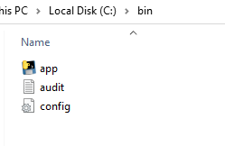

---

## 6. Operating Procedure

Navigate to:

```
http://<host>:5000
```

Login using an AD account that is a member of **reset_group**.

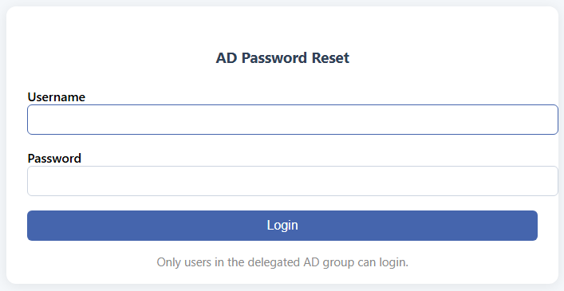

Perform:

- Password reset (temporary password + force change)
- Unlock account (clears lockoutTime)

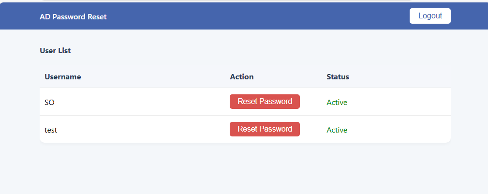

---

## 7. Audit Logging
All activity is logged in `audit.log`.  
Archive and protect logs according to your policies.

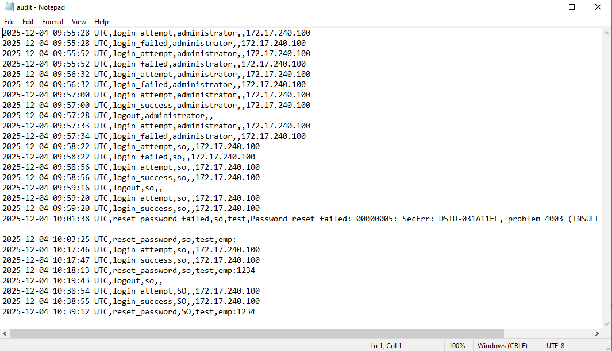

---

